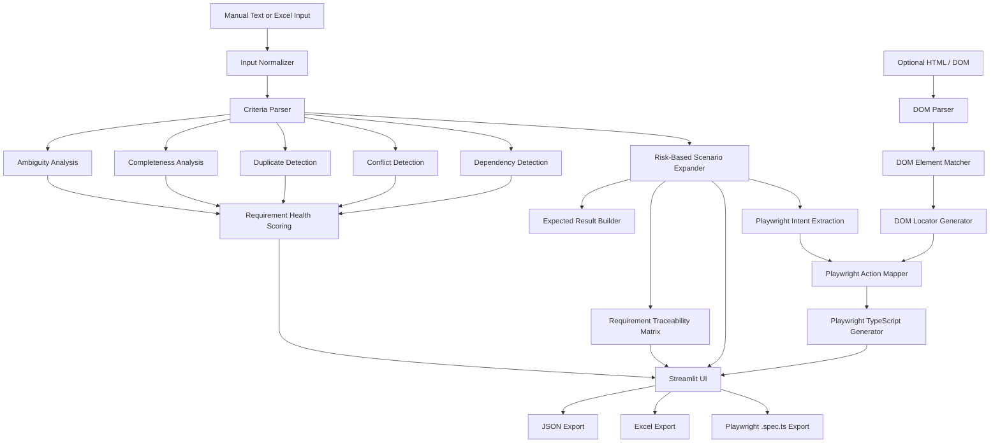

# Spec2Test Intelligence

**Spec2Test Intelligence** is an open-source requirements intelligence, risk-based test design, and Playwright automation generation platform for QA engineers and developers.

Instead of immediately generating test scenarios from whatever text it receives, Spec2Test first evaluates requirement quality, completeness, ambiguity, duplication, conflicts, and dependencies.

It then generates structured test cases based on requirement priority, creates a Requirement Traceability Matrix (RTM), and can convert supported test cases into Playwright TypeScript automation.

For Playwright generation, users can optionally provide HTML/DOM input so Spec2Test can match requirement interactions to application elements and generate more grounded locators.

The current release is intentionally **deterministic and explainable**. LLM-based semantic analysis is not required by the current processing pipeline.

---

## Why Spec2Test?

Test design often starts before requirements are truly testable.

A requirement such as:

> User should log in quickly.

can generate test cases, but it still leaves important questions unanswered:

- What does *quickly* mean?
- What should happen after login?
- What preconditions apply?
- How will success be verified?
- Which negative and edge scenarios should be tested?

Spec2Test addresses that earlier stage of the QA workflow.

It evaluates the requirement first, explains potential quality issues, generates risk-based test coverage, maintains traceability, and can translate supported test interactions into Playwright TypeScript.

---

## Current Capabilities

| Capability | What Spec2Test Does |
| --- | --- |
| Requirement Parsing | Supports plain acceptance criteria, strict Given/When/Then, and loose conversational Gherkin |
| Multi-Requirement Processing | Separates multiple Gherkin requirement blocks and preserves requirement-level isolation |
| Ambiguity Detection | Identifies vague or subjective requirement wording |
| Completeness Analysis | Checks actor, action, expected result, validation criteria, and preconditions |
| Duplicate Detection | Detects normalized duplicate requirements |
| Conflict Detection | Flags direct contradictory requirements such as allow vs. deny behavior |
| Dependency Detection | Identifies potential relationships between requirements |
| Requirement Health | Produces an explainable health score from deterministic requirement-quality signals |
| Risk-Based Test Generation | Generates deeper test coverage for higher-priority requirements |
| Requirement Traceability | Maps requirements to generated scenarios and calculates expected coverage |
| Excel Requirement Input | Imports requirement IDs, acceptance criteria, and priority from Excel |
| Structured Export | Exports generated test cases to JSON and Excel |
| Playwright Generation | Converts supported generated test cases into deterministic Playwright TypeScript |
| DOM Analysis | Optionally parses uploaded HTML to identify supported interactive elements |
| DOM Element Matching | Matches automation intent against relevant DOM elements |
| Locator Ranking | Selects resilient Playwright locators using deterministic rules |
| DOM-Aware Playwright | Uses uploaded DOM information when available and safely falls back to inferred locators |
| Playwright Export | Downloads generated automation as a `.spec.ts` file |
| Automation Review Warnings | Identifies generated tests where executable behavior or assertions require human review |
| Data Testing Foundation | Generates basic field-level data validation scenarios from structured rules |
| Automated Testing | Regression suite covering requirements intelligence, test generation, data testing, and Playwright generation |
| CI | GitHub Actions executes automated regression tests |

---

## End-to-End Workflow

```text
Requirements
     │
     ▼
Requirement Normalization
     │
     ▼
Criteria Parsing
     │
     ├──────────────► Requirement Intelligence
     │                 ├─ Ambiguity
     │                 ├─ Completeness
     │                 ├─ Duplicates
     │                 ├─ Conflicts
     │                 ├─ Dependencies
     │                 └─ Health Score
     │
     ▼
Risk-Based Test Generation
     │
     ├──────────────► Requirement Traceability Matrix
     │
     └──────────────► Playwright Automation
                       │
                       ▼
                 Intent Extraction
                       │
                       ▼
                  Action Mapping
                       │
             ┌─────────┴─────────┐
             │                   │
          No DOM             HTML / DOM
             │                   │
             ▼                   ▼
      Inferred Locator       DOM Parsing
                                 │
                                 ▼
                          Element Matching
                                 │
                                 ▼
                          Locator Ranking
                                 │
             └─────────┬─────────┘
                       ▼
              TypeScript Generation
                       │
                       ▼
                  .spec.ts Export
```

---

## Risk-Based Test Generation

Spec2Test does not generate the same number of scenarios for every requirement.

| Priority | Generated Scenario Types |
| --- | --- |
| Low | Positive, Negative |
| Medium | Positive, Negative, Edge |
| High | Positive, Negative, Edge, Boundary |
| Critical | Positive, Negative, Edge, Boundary, Security |

This makes test design proportional to requirement risk instead of treating every feature identically.

---

## Requirement Health Scoring

Requirement Health is calculated from deterministic analysis signals.

| Dimension | Weight |
| --- | ---: |
| Completeness | 40% |
| Clarity | 25% |
| Uniqueness | 15% |
| Consistency | 15% |
| Dependency complexity | 5% |

The score is explainable. Users can see which checks affected the result instead of receiving an opaque generated score.

---

## Requirement Intelligence Example

### Input

```text
1. User should be able to log in with valid credentials.

2. User should be able to log in with valid credentials.

3. System should allow guest checkout.

4. System should not allow guest checkout.

5. Dashboard should load quickly.
```

### Requirement Intelligence

Spec2Test can identify signals such as:

```text
Duplicate:
AC-002 duplicates AC-001

Conflict:
AC-004 conflicts with AC-003

Ambiguity:
"quickly"

Potential Dependency:
Dashboard access may depend on login
```

The requirements can then continue through risk-based test generation and traceability.

---

## Playwright Automation Generation

Spec2Test can convert supported generated test cases into Playwright TypeScript.

For example:

```gherkin
Given user is example.com/register
When user enters John into First Name
And user enters Smith into Last Name
And user selects United States from Country
And user checks Remember me
Then "Registration completed" is displayed
```

can produce automation similar to:

```typescript
import { test, expect } from '@playwright/test';

test(
  'TC-001-P1 - Validate user can complete the form successfully',
  async ({ page }) => {

    // Requirement: AC-001
    // Scenario: Positive
    // Priority: Medium

    await page.goto('https://example.com/register');

    await page
      .getByLabel('First Name')
      .fill('John');

    await page
      .getByLabel('Last Name')
      .fill('Smith');

    await page
      .getByLabel('Country')
      .selectOption('United States');

    await page
      .getByLabel('Remember Me')
      .check();

    await expect(
      page.getByText('Registration completed')
    ).toBeVisible();
  }
);
```

Generated automation retains traceability information such as:

- Requirement ID
- Test case ID
- Scenario type
- Priority
- Source acceptance criterion

---

## Supported Playwright Interactions

The deterministic Playwright generation layer currently supports common browser interactions including:

- Page navigation
- Text-field input
- Button clicks
- Link clicks
- Dropdown selection
- Checkbox interactions
- Radio-button interactions
- Keyboard actions
- File upload
- Visible-text assertions
- URL assertions
- Selected field-value assertions
- Button-enabled assertions

When Spec2Test cannot safely infer sufficient executable behavior or an assertion, it generates a review warning or TODO instead of inventing application behavior.

---

## DOM-Aware Playwright Generation

Spec2Test supports two locator-generation modes.

### Requirement-Inferred Mode

When HTML/DOM is not supplied, Spec2Test derives locators from requirement and test information.

For example:

```text
user enters Playwright into Search
```

may produce:

```typescript
await page
  .getByLabel('Search')
  .fill('Playwright');
```

### DOM-Aware Mode

Users can optionally upload HTML representing the relevant application DOM.

For example:

```html
<label for="account-email">
  Account Email
</label>

<input
  id="account-email"
  type="email"
  data-testid="login-email"
/>
```

Spec2Test parses supported interactive elements and attempts to match automation intent against the DOM.

In this example, it can generate:

```typescript
await page
  .getByLabel('Account Email')
  .fill('user@example.com');
```

rather than relying only on the requirement-inferred locator.

DOM input remains **optional**. Existing requirement-only automation generation continues to work without HTML.

---

## DOM Locator Strategy

The DOM-aware Playwright layer uses deterministic locator selection.

Supported locator strategies include:

1. Accessible role and name
2. Associated label
3. ARIA label
4. Test ID
5. Placeholder
6. Visible text
7. CSS ID
8. CSS name

The matcher first requires meaningful semantic evidence between the automation target and a DOM element.

Structural information such as HTML tag or input type can strengthen an existing semantic match, but structural similarity alone does not create a match.

If no suitable DOM element can be identified, Spec2Test safely falls back to its requirement-inferred locator rather than forcing an unrelated DOM match.

---

## Excel Input

Requirements can also be uploaded through an Excel workbook.

Example:

| Requirement ID | Acceptance Criteria | Priority |
| --- | --- | --- |
| REQ-101 | Customer can submit a loan application. | High |
| REQ-102 | System should generate a loan decision. | Critical |
| REQ-103 | Customer can view application status. | Medium |

Uploaded Requirement IDs and priorities are preserved through parsing, test generation, traceability, and export.

A sample workbook template is available from the Streamlit interface.

---

## Requirement Traceability Matrix

The RTM connects each requirement to its generated scenarios.

| Requirement | Positive | Negative | Edge | Boundary | Security | Coverage |
| --- | ---: | ---: | ---: | ---: | ---: | ---: |
| REQ-101 | 1 | 1 | 1 | 1 | 0 | 100% |
| REQ-102 | 1 | 1 | 1 | 1 | 1 | 100% |
| REQ-103 | 1 | 1 | 1 | 0 | 0 | 100% |

Expected coverage is calculated according to requirement priority rather than assuming every requirement should produce the same scenario types.

---

## Architecture



---

## Project Structure

```text
Spec2Test-Intelligence/
│
├── .github/
│   └── workflows/
│       └── tests.yml
│
├── app/
│   ├── config.py
│   ├── streamlit_app.py
│   └── ui/
│       ├── dashboard.py
│       ├── data_testing.py
│       ├── exports.py
│       ├── filters.py
│       ├── helpers.py
│       ├── playwright.py
│       ├── requirement_panel.py
│       ├── session.py
│       ├── templates.py
│       ├── testcase_cards.py
│       └── traceability.py
│
├── examples/
│   └── sample_dom.html
│
├── src/
│   ├── analytics/
│   ├── data_testing/
│   ├── ingestion/
│   ├── models/
│   ├── oracle_builder/
│   ├── parsing/
│   ├── playwright/
│   │   ├── action_mapper.py
│   │   ├── dom_models.py
│   │   ├── dom_parser.py
│   │   ├── element_matcher.py
│   │   ├── generator.py
│   │   ├── intent.py
│   │   ├── locator_generator.py
│   │   └── models.py
│   ├── requirements_analysis/
│   ├── scenario_expander/
│   └── traceability/
│
├── tests/
├── LICENSE
├── README.md
└── requirements.txt
```

---

## Installation

Clone the repository:

```bash
git clone https://github.com/gaya3bollineni/Spec2Test-Intelligence.git

cd Spec2Test-Intelligence
```

Install dependencies:

```bash
pip install -r requirements.txt
```

Run the application:

```bash
PYTHONPATH=. python3 -m streamlit run app/streamlit_app.py
```

---

## Running Tests

Run the complete regression suite:

```bash
PYTHONPATH=. python3 -m pytest tests/ -q
```

Current verified regression status:

```text
144 passed
```

Coverage can be generated with:

```bash
PYTHONPATH=. python3 -m pytest tests/ -v \
  --cov=src \
  --cov=app \
  --cov-report=term-missing
```

GitHub Actions also executes the automated test suite.

---

## Data Testing

The repository contains the first deterministic Data Testing capability.

Users can define field-level rules such as:

- Data type
- Required fields
- Minimum and maximum values
- Allowed values
- Uniqueness

Spec2Test converts those rules into structured data-validation scenarios.

Database connectivity, source-to-target reconciliation, SQL generation, and large-scale data validation remain outside the current implementation.

---

## Current Limitations

The current release focuses on deterministic and explainable analysis and automation generation.

Duplicate detection is normalization-based rather than semantic.

Conflict detection currently focuses on direct contradictions.

Dependency detection uses defined relationship rules and should be treated as a potential-dependency signal rather than definitive business-process inference.

Playwright automation is **generated but not executed by Spec2Test**. Generated `.spec.ts` files are intended for review and execution in an appropriate Playwright environment.

DOM-aware locator generation operates on optional uploaded HTML. It does not connect to or inspect a live application.

DOM parsing currently focuses on supported interactive HTML elements and deterministic matching rules.

If DOM matching cannot identify an appropriate element, Spec2Test falls back to requirement-inferred locator generation.

Negative and edge automation variants are intentionally conservative, and some scenarios may contain review warnings or TODO assertions when application-specific behavior cannot be safely inferred.

The system does not currently use an LLM to infer semantic equivalence, rewrite requirements, or invent complex domain behavior.

These limitations are intentional so the core analysis and generation pipeline remains transparent, testable, and explainable.

---

## Roadmap

Development priorities will be influenced by real project usage and community feedback rather than adding automation features solely for feature breadth.

| Area | Potential Future Capability |
| --- | --- |
| Playwright Test Data | Improve negative, edge, and boundary automation data generation |
| Playwright Assertions | Expand deterministic assertion coverage |
| Semantic Intelligence | Semantic duplicate and similarity analysis |
| Advanced Conflict Analysis | Identify contradictions beyond direct positive/negative wording |
| Requirement Improvement | Assisted improvement of weak or incomplete acceptance criteria |
| Advanced Test Design | More context-aware scenario expansion |
| Data Testing Phase 2 | Source-to-target mapping, reconciliation, SQL validation, and database testing |
| Integrations | Jira, qTest, Xray, and related QA workflow integrations |
| Reporting | Rich requirement-quality and test-coverage reporting |

New locator configuration and additional Playwright capabilities can be evaluated based on actual user feedback.

---

## Testing and Quality

Spec2Test itself is developed using automated regression tests.

The suite currently validates areas including:

- Requirement normalization
- Multi-requirement Gherkin separation
- Acceptance-criteria parsing
- Loose Gherkin handling
- Excel ingestion
- Metadata preservation
- Duplicate detection
- Conflict detection
- Dependency detection
- Requirement Health scoring
- Risk-based scenario expansion
- Requirement traceability
- Data-testing behavior
- Playwright intent extraction
- Playwright action mapping
- Playwright TypeScript generation
- Extended browser interactions
- Multi-requirement Playwright isolation
- DOM parsing
- DOM element matching
- DOM locator generation
- DOM-aware action mapping
- DOM-aware TypeScript generation
- Safe locator fallback behavior

Current verified regression status:

**144 passing tests**

---

## Privacy

Spec2Test's community usage metrics are limited to anonymous aggregate counters such as sessions and test generations.

Requirement text and generated test content are not intentionally collected as part of these usage counters.

Users should avoid submitting confidential, sensitive, or personally identifiable information to a publicly hosted demonstration instance.

---

## Contributing

Contributions and constructive feedback are welcome.

Issues can be used for:

- Bug reports
- Enhancement proposals
- Requirement-analysis ideas
- Playwright generation improvements
- Additional deterministic rules
- Regression test cases

Pull requests should include tests for behavior changes wherever practical.

---

## License

This project is distributed under the license included in the repository.

---

## Status

**Deterministic MVP — Requirements Intelligence + Risk-Based Test Design + DOM-Aware Playwright Generation**

The current goal is to validate the architecture, gather developer and QA feedback, and evolve Spec2Test based on real usage while keeping requirement analysis, test generation, and automation explainable.