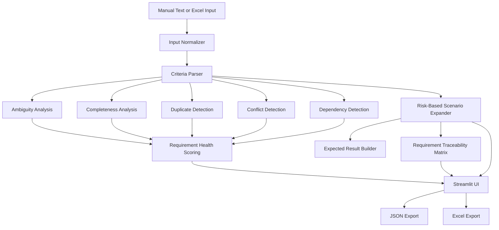

# Spec2Test Intelligence

**Spec2Test Intelligence** is an open-source requirements intelligence and risk-based test design platform built to help QA engineers evaluate requirements before turning them into test cases.

Instead of immediately generating scenarios from whatever text it receives, Spec2Test first examines requirement quality, completeness, ambiguity, duplication, conflicts, and dependencies. It then generates structured test cases based on requirement priority and creates a Requirement Traceability Matrix to show coverage.

The current release is intentionally **deterministic and explainable**. LLM-based semantic analysis is planned as a future enhancement rather than being used as a substitute for transparent validation rules.

---

## Why Spec2Test?

Test design often starts before requirements are truly testable.

A requirement such as:

> User should log in quickly.

can generate test cases, but it still leaves important questions unanswered. What does *quickly* mean? What should happen after login? What preconditions apply? How will success be verified?

Spec2Test addresses that earlier stage of the QA workflow.

It evaluates the requirement first, explains potential quality issues, and then generates test coverage.

---

## Current Capabilities

| Capability                 | What Spec2Test Does                                                                                         |
| -------------------------- | ----------------------------------------------------------------------------------------------------------- |
| Requirement Parsing        | Supports plain acceptance criteria, strict Given/When/Then, and loose conversational Gherkin                |
| Ambiguity Detection        | Identifies vague terms such as `quickly`, `properly`, and similar subjective wording                        |
| Completeness Analysis      | Checks actor, action, expected result, validation criteria, and preconditions                               |
| Duplicate Detection        | Detects normalized duplicate requirements                                                                   |
| Conflict Detection         | Flags direct contradictory requirements such as allow vs. deny behavior                                     |
| Dependency Detection       | Identifies potential dependencies such as dashboard access depending on login                               |
| Requirement Health         | Produces an explainable health score using completeness, clarity, uniqueness, consistency, and dependencies |
| Risk-Based Test Generation | Generates deeper test coverage for higher-priority requirements                                             |
| Requirement Traceability   | Maps requirements to generated scenarios and calculates coverage                                            |
| Excel Requirement Input    | Imports requirement IDs, acceptance criteria, and priority from Excel                                       |
| Structured Export          | Exports generated test cases to JSON and Excel                                                              |
| Data Testing Foundation    | Generates basic field-level data validation scenarios from structured rules                                 |
| Automated Testing          | Regression suite covering the deterministic processing pipeline                                             |
| CI                         | GitHub Actions runs automated tests against supported Python versions                                       |

---

## Risk-Based Test Generation

Spec2Test does not generate the same number of scenarios for every requirement.

| Priority | Generated Scenario Types                     |
| -------- | -------------------------------------------- |
| Low      | Positive, Negative                           |
| Medium   | Positive, Negative, Edge                     |
| High     | Positive, Negative, Edge, Boundary           |
| Critical | Positive, Negative, Edge, Boundary, Security |

This makes test design proportional to requirement risk instead of treating every feature identically.

---

## Requirement Health Scoring

Requirement Health is calculated from existing deterministic analysis signals.

| Dimension             | Weight |
| --------------------- | -----: |
| Completeness          |    40% |
| Clarity               |    25% |
| Uniqueness            |    15% |
| Consistency           |    15% |
| Dependency complexity |     5% |

The score is explainable: users can see which checks affected the result rather than receiving an opaque AI-generated number.

---

## Example

### Input

```text
1. User should be able to log in with valid credentials.
2. User should be able to log in with valid credentials.
3. System should allow guest checkout.
4. System should not allow guest checkout.
5. Dashboard should load quickly.
```

### Requirement Intelligence

Spec2Test can identify:

```text
Duplicate:
AC-002 duplicates AC-001

Conflict:
AC-004 conflicts with AC-003

Ambiguity:
"quickly"

Potential Dependency:
Dashboard access may depend on login
```

The same requirements are then passed to the test-generation and traceability pipeline.

---

## Excel Input

Requirements can also be uploaded through an Excel workbook.

Example:

| Requirement ID | Acceptance Criteria                     | Priority |
| -------------- | --------------------------------------- | -------- |
| REQ-101        | Customer can submit a loan application. | High     |
| REQ-102        | System should generate a loan decision. | Critical |
| REQ-103        | Customer can view application status.   | Medium   |

The uploaded Requirement IDs and priorities are preserved through parsing, test generation, traceability, and export.

A sample workbook template is available directly from the Streamlit interface.

---

## Requirement Traceability Matrix

The RTM connects each requirement to its generated scenarios.

| Requirement | Positive | Negative | Edge | Boundary | Security | Coverage |
| ----------- | -------: | -------: | ---: | -------: | -------: | -------: |
| REQ-101     |        1 |        1 |    1 |        1 |        0 |     100% |
| REQ-102     |        1 |        1 |    1 |        1 |        1 |     100% |
| REQ-103     |        1 |        1 |    1 |        0 |        0 |     100% |

Expected coverage is calculated according to requirement priority rather than assuming that every requirement should produce the same number of tests.

---

## Architecture



---

## Project Structure

```text
Spec2Test-Intelligence/
│
├── .github/
│   └── workflows/
│       └── tests.yml
│
├── app/
│   ├── config.py
│   ├── streamlit_app.py
│   └── ui/
│       ├── dashboard.py
│       ├── data_testing.py
│       ├── exports.py
│       ├── filters.py
│       ├── helpers.py
│       ├── requirement_panel.py
│       ├── session.py
│       ├── templates.py
│       ├── testcase_cards.py
│       └── traceability.py
│
├── src/
│   ├── data_testing/
│   ├── ingestion/
│   ├── models/
│   ├── oracle_builder/
│   ├── parsing/
│   ├── requirements_analysis/
│   ├── scenario_expander/
│   └── traceability/
│
├── tests/
│
├── LICENSE
├── README.md
└── requirements.txt
```

---

## Installation

Clone the repository:

```bash
git clone https://github.com/gaya3bollineni/Spec2Test-Intelligence.git
cd Spec2Test-Intelligence
```

Install dependencies:

```bash
pip install -r requirements.txt
```

Run the application:

```bash
PYTHONPATH=. python3 -m streamlit run app/streamlit_app.py
```

---

## Running Tests

Run the complete regression suite:

```bash
PYTHONPATH=. pytest tests/ -v
```

Current verified test status:

```text
56 passed
```

Coverage can be generated with:

```bash
PYTHONPATH=. pytest tests/ -v \
  --cov=src \
  --cov=app \
  --cov-report=term-missing
```

GitHub Actions also executes the automated test suite on supported Python versions.

---

## Data Testing

The repository currently contains the first deterministic Data Testing capability.

Users can define field-level rules such as data type, required fields, minimum/maximum values, allowed values, and uniqueness. Spec2Test converts those rules into structured data-validation scenarios.

Database connectivity, source-to-target reconciliation, SQL generation, and large-scale data validation are intentionally reserved for a later development phase.

---

## Current Limitations

The current release focuses on deterministic and explainable analysis.

Duplicate detection is normalization-based rather than semantic. Conflict detection currently focuses on direct contradictions. Dependency detection uses defined relationship rules and should be treated as a potential-dependency signal rather than definitive business-process inference.

The system does not currently use an LLM to understand semantic equivalence, rewrite requirements, or infer complex domain behavior.

These limitations are intentional for the initial release so that the core analysis remains transparent and testable.

---

## Roadmap

| Phase                      | Planned Capability                                                             |
| -------------------------- | ------------------------------------------------------------------------------ |
| Semantic Intelligence      | Semantic duplicate and similarity detection                                    |
| Advanced Conflict Analysis | Detect contradictions beyond direct positive/negative wording                  |
| Requirement Improvement    | AI-assisted rewriting of weak acceptance criteria                              |
| Advanced Test Design       | Context-aware scenario expansion                                               |
| Data Testing Phase 2       | Source-to-target mapping, reconciliation, SQL validation, and database testing |
| Integrations               | Jira, qTest, and Xray export/integration                                       |
| Reporting                  | Rich requirement-quality and test-coverage reports                             |

---

## Testing and Quality

Spec2Test itself is developed using automated regression tests.

The current suite validates requirement normalization, parsing, loose Gherkin handling, Excel ingestion, metadata preservation, duplicate detection, conflict detection, dependency detection, health scoring, risk-based test generation, traceability, and data-testing behavior.

The test suite currently contains **56 passing tests**.

---

## Contributing

Contributions and constructive feedback are welcome.

Issues can be used for bug reports, enhancement proposals, requirement-analysis ideas, and additional test cases. Pull requests should include tests for behavior changes wherever practical.

---

## License

This project is distributed under the license included in the repository.

---

## Status

**Initial deterministic MVP**

The current goal is to validate the architecture, gather developer and QA feedback, and evolve Spec2Test based on real usage before introducing semantic/LLM capabilities.
