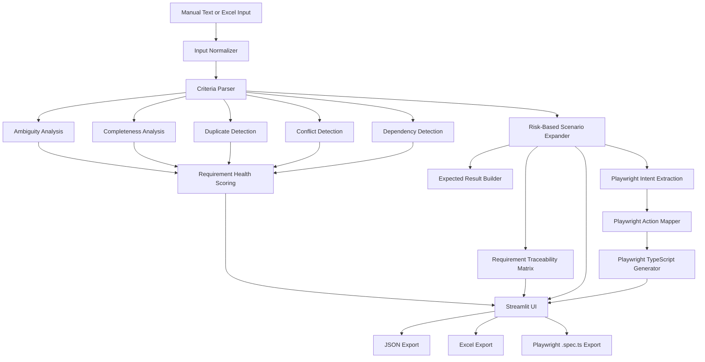

# Spec2Test Intelligence

**Spec2Test Intelligence** is an open-source requirements intelligence, risk-based test design, and Playwright automation generation platform for QA engineers and developers.

Instead of immediately generating test scenarios from whatever text it receives, Spec2Test first evaluates requirement quality, completeness, ambiguity, duplication, conflicts, and dependencies. It then generates structured test cases based on requirement priority, creates a Requirement Traceability Matrix (RTM), and can convert generated test cases into Playwright TypeScript automation.

The current release is intentionally **deterministic and explainable**. LLM-based semantic analysis is planned as a future enhancement rather than being used as a substitute for transparent validation rules.

---

## Why Spec2Test?

Test design often starts before requirements are truly testable.

A requirement such as:

> User should log in quickly.

can generate test cases, but it still leaves important questions unanswered:

- What does *quickly* mean?
- What should happen after login?
- What preconditions apply?
- How will success be verified?
- Which negative and edge scenarios should be tested?

Spec2Test addresses that earlier stage of the QA workflow.

It evaluates the requirement first, explains potential quality issues, generates risk-based test coverage, maintains traceability, and can translate supported test interactions into Playwright TypeScript.

---

## Current Capabilities

| Capability | What Spec2Test Does |
| --- | --- |
| Requirement Parsing | Supports plain acceptance criteria, strict Given/When/Then, and loose conversational Gherkin |
| Multi-Requirement Processing | Separates multiple Gherkin requirement blocks and preserves requirement-level isolation |
| Ambiguity Detection | Identifies vague terms such as `quickly`, `properly`, and similar subjective wording |
| Completeness Analysis | Checks actor, action, expected result, validation criteria, and preconditions |
| Duplicate Detection | Detects normalized duplicate requirements |
| Conflict Detection | Flags direct contradictory requirements such as allow vs. deny behavior |
| Dependency Detection | Identifies potential dependencies such as dashboard access depending on login |
| Requirement Health | Produces an explainable health score using completeness, clarity, uniqueness, consistency, and dependencies |
| Risk-Based Test Generation | Generates deeper test coverage for higher-priority requirements |
| Requirement Traceability | Maps requirements to generated scenarios and calculates coverage |
| Excel Requirement Input | Imports requirement IDs, acceptance criteria, and priority from Excel |
| Structured Export | Exports generated test cases to JSON and Excel |
| Playwright Generation | Converts supported generated test cases into deterministic Playwright TypeScript |
| Playwright Export | Downloads generated browser automation as a `.spec.ts` file |
| Automation Review Warnings | Identifies generated tests where executable actions or assertions require human review |
| Data Testing Foundation | Generates basic field-level data validation scenarios from structured rules |
| Automated Testing | Regression suite covering the deterministic processing and Playwright generation pipelines |
| CI | GitHub Actions runs automated tests against supported Python versions |

---

## Risk-Based Test Generation

Spec2Test does not generate the same number of scenarios for every requirement.

| Priority | Generated Scenario Types |
| --- | --- |
| Low | Positive, Negative |
| Medium | Positive, Negative, Edge |
| High | Positive, Negative, Edge, Boundary |
| Critical | Positive, Negative, Edge, Boundary, Security |

This makes test design proportional to requirement risk instead of treating every feature identically.

---

## Requirement Health Scoring

Requirement Health is calculated from existing deterministic analysis signals.

| Dimension | Weight |
| --- | ---: |
| Completeness | 40% |
| Clarity | 25% |
| Uniqueness | 15% |
| Consistency | 15% |
| Dependency complexity | 5% |

The score is explainable: users can see which checks affected the result rather than receiving an opaque AI-generated number.

---

## Requirement Intelligence Example

### Input

```text
1. User should be able to log in with valid credentials.
2. User should be able to log in with valid credentials.
3. System should allow guest checkout.
4. System should not allow guest checkout.
5. Dashboard should load quickly.
```

### Requirement Intelligence

Spec2Test can identify signals such as:

```text
Duplicate:
AC-002 duplicates AC-001

Conflict:
AC-004 conflicts with AC-003

Ambiguity:
"quickly"

Potential Dependency:
Dashboard access may depend on login
```

The same requirements are then passed to the test-generation and traceability pipeline.

---

## Playwright Automation Generation

Spec2Test can convert generated test cases into Playwright TypeScript automation.

For example, an acceptance criterion such as:

```gherkin
Given user is example.com/register
When user enters John into First Name
And user enters Smith into Last Name
And user selects United States from Country
And user checks Remember me
Then "Registration completed" is displayed
```

can produce Playwright code similar to:

```typescript
import { test, expect } from '@playwright/test';

test('TC-001-P1 - Validate user can complete the form successfully', async ({ page }) => {
  // Requirement: AC-001
  // Scenario: Positive
  // Priority: Medium

  await page.goto('https://example.com/register');
  await page.getByLabel('First Name').fill('John');
  await page.getByLabel('Last Name').fill('Smith');
  await page.getByLabel('Country').selectOption('United States');
  await page.getByLabel('Remember Me').check();

  await expect(
    page.getByText('Registration completed')
  ).toBeVisible();
});
```

Generated automation retains traceability information including:

- Requirement ID
- Test case ID
- Scenario type
- Priority
- Source acceptance criterion

---

## Supported Playwright Interactions

The deterministic Playwright generation layer currently supports common browser interactions including:

- Page navigation
- Text field input
- Button clicks
- Link clicks
- Dropdown selection
- Checkbox interactions
- Radio-button interactions
- Keyboard actions
- File upload
- Visible-text assertions
- URL assertions
- Selected field-value assertions
- Button-enabled assertions

When Spec2Test cannot safely infer an executable assertion or sufficient automation behavior, it generates a review warning or TODO instead of inventing application behavior.

---

## Playwright Locator Strategy

The current Playwright generator derives locators from requirement and test-step information.

For example:

```text
user enters Playwright into Search
```

may generate:

```typescript
await page.getByLabel('Search').fill('Playwright');
```

Because Spec2Test does **not currently inspect the application's DOM**, generated locators should be reviewed before executing the automation against a real application.

DOM-aware locator generation is planned as the next Playwright enhancement.

---

## Excel Input

Requirements can also be uploaded through an Excel workbook.

Example:

| Requirement ID | Acceptance Criteria | Priority |
| --- | --- | --- |
| REQ-101 | Customer can submit a loan application. | High |
| REQ-102 | System should generate a loan decision. | Critical |
| REQ-103 | Customer can view application status. | Medium |

Uploaded Requirement IDs and priorities are preserved through parsing, test generation, traceability, and export.

A sample workbook template is available directly from the Streamlit interface.

---

## Requirement Traceability Matrix

The RTM connects each requirement to its generated scenarios.

| Requirement | Positive | Negative | Edge | Boundary | Security | Coverage |
| --- | ---: | ---: | ---: | ---: | ---: | ---: |
| REQ-101 | 1 | 1 | 1 | 1 | 0 | 100% |
| REQ-102 | 1 | 1 | 1 | 1 | 1 | 100% |
| REQ-103 | 1 | 1 | 1 | 0 | 0 | 100% |

Expected coverage is calculated according to requirement priority rather than assuming that every requirement should produce the same number of tests.

---

## Architecture



---

## Processing Flow

```text
Requirements
     │
     ▼
Input Normalization
     │
     ▼
Criteria Parsing
     │
     ├──────────────► Requirement Intelligence
     │                ├─ Ambiguity
     │                ├─ Completeness
     │                ├─ Duplicates
     │                ├─ Conflicts
     │                ├─ Dependencies
     │                └─ Health Score
     │
     ▼
Risk-Based Test Generation
     │
     ├──────────────► Requirement Traceability Matrix
     │
     └──────────────► Playwright Intent Extraction
                           │
                           ▼
                     Action Mapping
                           │
                           ▼
                    TypeScript Generation
                           │
                           ▼
                       .spec.ts
```

---

## Project Structure

```text
Spec2Test-Intelligence/
│
├── .github/
│   └── workflows/
│       └── tests.yml
│
├── app/
│   ├── config.py
│   ├── streamlit_app.py
│   └── ui/
│       ├── dashboard.py
│       ├── data_testing.py
│       ├── exports.py
│       ├── filters.py
│       ├── helpers.py
│       ├── playwright.py
│       ├── requirement_panel.py
│       ├── session.py
│       ├── templates.py
│       ├── testcase_cards.py
│       └── traceability.py
│
├── src/
│   ├── analytics/
│   ├── data_testing/
│   ├── ingestion/
│   ├── models/
│   ├── oracle_builder/
│   ├── parsing/
│   ├── playwright/
│   │   ├── action_mapper.py
│   │   ├── generator.py
│   │   ├── intent.py
│   │   └── models.py
│   ├── requirements_analysis/
│   ├── scenario_expander/
│   └── traceability/
│
├── tests/
│
├── LICENSE
├── README.md
└── requirements.txt
```

---

## Installation

Clone the repository:

```bash
git clone https://github.com/gaya3bollineni/Spec2Test-Intelligence.git
cd Spec2Test-Intelligence
```

Install dependencies:

```bash
pip install -r requirements.txt
```

Run the application:

```bash
PYTHONPATH=. python3 -m streamlit run app/streamlit_app.py
```

---

## Running Tests

Run the complete regression suite:

```bash
PYTHONPATH=. python3 -m pytest tests/ -q
```

Current verified test status:

```text
98 passed
```

Coverage can be generated with:

```bash
PYTHONPATH=. python3 -m pytest tests/ -v \
  --cov=src \
  --cov=app \
  --cov-report=term-missing
```

GitHub Actions also executes the automated test suite on supported Python versions.

---

## Data Testing

The repository currently contains the first deterministic Data Testing capability.

Users can define field-level rules such as:

- Data type
- Required fields
- Minimum and maximum values
- Allowed values
- Uniqueness

Spec2Test converts those rules into structured data-validation scenarios.

Database connectivity, source-to-target reconciliation, SQL generation, and large-scale data validation are intentionally reserved for a later development phase.

---

## Current Limitations

The current release focuses on deterministic and explainable analysis and automation generation.

Duplicate detection is normalization-based rather than semantic. Conflict detection currently focuses on direct contradictions. Dependency detection uses defined relationship rules and should be treated as a potential-dependency signal rather than definitive business-process inference.

Playwright automation is **generated but not executed by Spec2Test**. Application-specific locators, data, and assertions should be reviewed before running the generated `.spec.ts` file in a Playwright environment.

The current locator generator does not inspect the live DOM or uploaded HTML.

Negative and edge automation variants are intentionally conservative, and some scenarios may contain TODO assertions when application-specific behavior cannot be safely inferred.

The system does not currently use an LLM to understand semantic equivalence, rewrite requirements, or infer complex domain behavior.

These limitations are intentional so that the core analysis and generation pipeline remains transparent and testable.

---

## Roadmap

| Phase | Planned Capability |
| --- | --- |
| DOM-Aware Playwright | Optional HTML/DOM upload, element matching, locator ranking, and DOM-grounded Playwright generation |
| Locator Intelligence | Recommend resilient locators using role, label, test ID, placeholder, and safe fallback strategies |
| Playwright Test Data | Improve negative, edge, and boundary automation data generation |
| Playwright Assertions | Expand deterministic assertion support |
| Semantic Intelligence | Semantic duplicate and similarity detection |
| Advanced Conflict Analysis | Detect contradictions beyond direct positive/negative wording |
| Requirement Improvement | AI-assisted rewriting of weak acceptance criteria |
| Advanced Test Design | Context-aware scenario expansion |
| Data Testing Phase 2 | Source-to-target mapping, reconciliation, SQL validation, and database testing |
| Integrations | Jira, qTest, and Xray export/integration |
| Reporting | Rich requirement-quality and test-coverage reports |

---

## Next Playwright Milestone: DOM-Aware Locator Generation

The next planned Playwright enhancement is optional DOM-aware locator generation.

The intended workflow is:

```text
Acceptance Criteria
        │
        ▼
Generated Test Cases
        │
        ▼
Automation Intent
        │
        ├── No DOM
        │      │
        │      ▼
        │  Inferred Locators
        │
        └── DOM / HTML Provided
               │
               ▼
          DOM Analysis
               │
               ▼
          Element Matching
               │
               ▼
          Locator Ranking
               │
               ▼
        DOM-Grounded Playwright
```

For example, if uploaded HTML contains:

```html
<input
    id="user-email"
    type="email"
    placeholder="Enter your email"
    data-testid="login-email"
/>
```

Spec2Test could recommend:

```typescript
page.getByTestId('login-email')
```

while retaining alternatives such as:

```typescript
page.getByPlaceholder('Enter your email')
```

and a fallback locator where necessary.

DOM input will remain optional so the existing requirement-only Playwright generation workflow continues to work.

---

## Testing and Quality

Spec2Test itself is developed using automated regression tests.

The current suite validates areas including:

- Requirement normalization
- Multi-requirement Gherkin separation
- Acceptance-criteria parsing
- Loose Gherkin handling
- Excel ingestion
- Metadata preservation
- Duplicate detection
- Conflict detection
- Dependency detection
- Requirement Health scoring
- Risk-based scenario expansion
- Requirement traceability
- Data-testing behavior
- Playwright intent extraction
- Playwright action mapping
- Playwright TypeScript generation
- Extended browser interactions
- Multi-requirement Playwright isolation

Current verified regression status:

**98 passing tests**

---

## Privacy

Spec2Test's community usage metrics are limited to anonymous aggregate counters such as sessions and test generations.

Requirement text and generated test content are not intentionally collected as part of these usage counters.

Users should avoid submitting confidential, sensitive, or personally identifiable information to a publicly hosted demonstration instance.

---

## Contributing

Contributions and constructive feedback are welcome.

Issues can be used for:

- Bug reports
- Enhancement proposals
- Requirement-analysis ideas
- Playwright generation improvements
- Additional deterministic rules
- Regression test cases

Pull requests should include tests for behavior changes wherever practical.

---

## License

This project is distributed under the license included in the repository.

---

## Status

**Deterministic MVP — Requirements Intelligence + Risk-Based Test Design + Playwright Generation**

The current goal is to validate the architecture, gather developer and QA feedback, and evolve Spec2Test based on real usage while keeping generated analysis and automation explainable.

Semantic/LLM capabilities remain future enhancements rather than dependencies of the current deterministic pipeline.